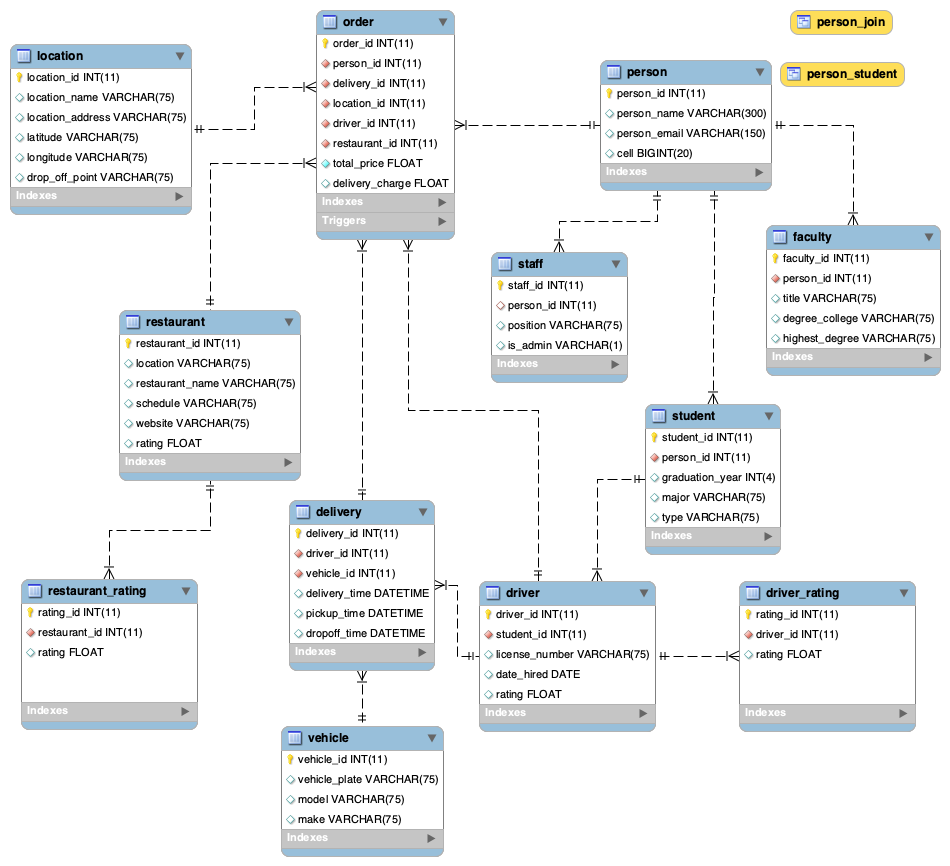

# Group18_DatabaseDesign
## Introduction
For this project, my group was tasked with understanding and enhancing a database system, utilizing MySQL, that is a campus controlled food delivery service (similar to craveoncampus.com which was created due to the changes COVID-19 caused). Regarding the enhancements of the database, we were responsible for adding a rating system for the restaurants and the delivery drivers.
### Project Description
Delivery services such as UberEats and Postmates have impacted the restaurant industry immensely. They are not only impacting the food industry, but creating more job opportunities consequently increasing the employment rate and creating new ways of dining from the comfort of their house. Due to COVID-19, the use of these services have increased and there is a need to create and implement these delivery services to adjust to the new norm. An example of one of the places in need of a delivery service are universities. Due to safety and security reasons, it’s suggested that deliveries and orders should be made by a student or authorized university employee. For this assignment, we are enhancing the database using a rating system for both drivers and restaurants. For the rating system of the driver, we will be incorporating the delivery time attribute from the delivery entity, using the driver id from the driver entity, and creating new attributes called dropOff_time and rating. For the rating system of the restaurant, we will be incorporating the restaurant id from the restaurant entity and the driver’s information.
### Team/Group Members
- Kelsey Locaylocay
- Brian Colclough
- Vanessa Liaw
- Meselech Elala
- Tia Vang
## Use Case for Rating System

## Business Rules
- A person can be any staff member, any student, or any faculty member.
- All delivery personnel are students.
- Persons can also be drivers (delivery personnel have to be approved).
- Drivers can have many orders, deliveries, and ratings
- Drivers gratuities are dependent on better ratings and the number of on-time deliveries. There is a flat fee of $5 for each delivery. 
- Multiple orders can be sent to one location. Only one location can have one or many orders.
- Multiple orders can be made from one restaurant. Only one restaurant can have one or many orders.
- Multiple ratings can be made about one restaurant. One restaurant can have many ratings.
- All ratings are measured on a 1 to 5 rating scale, with 1 being unsatisfactory and 5 being outstanding.
- A delivery cannot be made without an order having been created.
- Locations are determined by latitude and longitude coordinates for enabled GPS tracking functionality (locations must be approved).
- One vehicle can be assigned many deliveries. 
## EERD(full database)
### EERD

### Data Dictionary
|Table|Field Name|Data Type|Field Length|Key(s)|Description|
|:----------|:---------|:----------|:---------|:----------|:---------|
|Delivery|delivery_time|DATETIME|N/A||When the order is estimated to be delivered|
|Delivery|dropoff_time|DATETIME|N/A||When the order is dropped off at customer's residence|
|restaurant_rating|restaurant_id|INT|11|FK|ID of specific restaurants|
|driver_rating|driver_id|INT|11|FK|ID of specific drivers|
|Restaurant_rating, driver_rating|rating_id|INT|11|PK|Keeps track of individual ratings|
|Restaurant_rating, driver_rating|rating|FLOAT|N/A||Overall rating of a driver|
## MySQL Queries
## Stored Procedure
## Web/App Implementation (Optional) or Description of Future Work
## MySQL Dump
[Here is the link to our SQL Dump](Dump20201205.sql)
## PPT Video (link)
