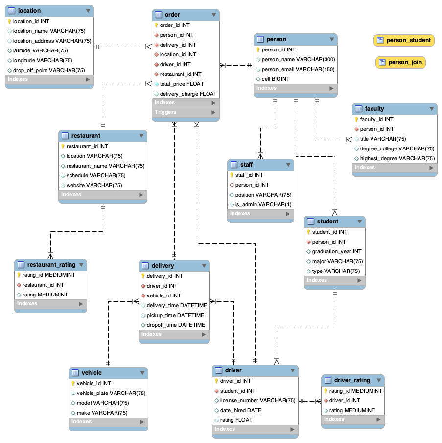
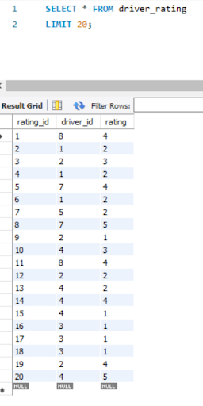
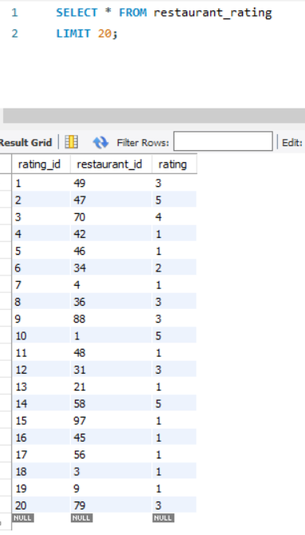
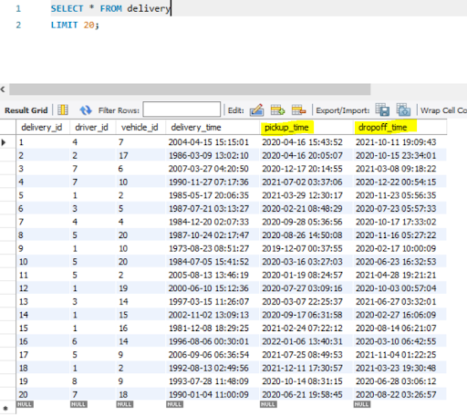
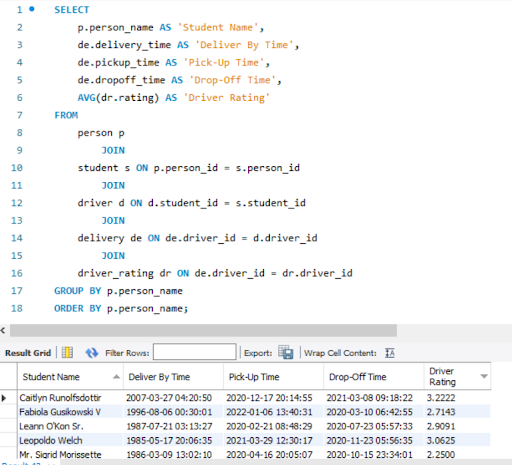
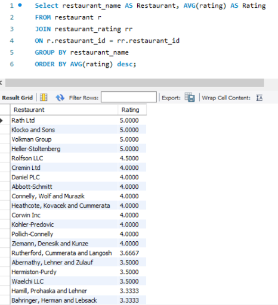

# Group18_DatabaseDesign
## Introduction
For this project, my group was tasked with understanding and enhancing a database system, utilizing MySQL, that is a campus controlled food delivery service (similar to craveoncampus.com which was created due to the changes COVID-19 caused). Regarding the enhancements of the database, we were responsible for adding a rating system for the restaurants and the delivery drivers.
### Project Description
Delivery services such as UberEats and Postmates have impacted the restaurant industry immensely. They are not only impacting the food industry, but creating more job opportunities consequently increasing the employment rate and creating new ways of dining from the comfort of their house. Due to COVID-19, the use of these services have increased and there is a need to create and implement these delivery services to adjust to the new norm. An example of one of the places in need of a delivery service are universities. Due to safety and security reasons, it’s suggested that deliveries and orders should be made by a student or authorized university employee. For this assignment, we are enhancing the database using a rating system for both drivers and restaurants. For the rating system of the driver, we will be incorporating the delivery time attribute from the delivery entity, using the driver id from the driver entity, and creating new attributes called dropOff_time and rating. For the rating system of the restaurant, we will be incorporating the restaurant id from the restaurant entity and the driver’s information.
### Team/Group Members
- Kelsey Locaylocay
- Brian Colclough
- Vanessa Liaw
- Meselech Elala
- Tia Vang
## Use Case for Rating System

## Business Rules
- A person can be any staff member, any student, or any faculty member.
- All delivery personnel are students.
- Persons can also be drivers (delivery personnel have to be approved).
- Drivers can have many orders, deliveries, and ratings
- Drivers gratuities are dependent on better ratings and the number of on-time deliveries. There is a flat fee of $5 for each delivery. 
- Multiple orders can be sent to one location. Only one location can have one or many orders.
- Multiple orders can be made from one restaurant. Only one restaurant can have one or many orders.
- Multiple ratings can be made about one restaurant. One restaurant can have many ratings.
- All ratings are measured on a 1 to 5 rating scale, with 1 being unsatisfactory and 5 being outstanding.
- A delivery cannot be made without an order having been created.
- Locations are determined by latitude and longitude coordinates for enabled GPS tracking functionality (locations must be approved).
- One vehicle can be assigned many deliveries. 
## EERD(full database)
### EERD

#### EERD Narrative
A person can be a student, faculty, or staff. A person has an id, a name, and an email address which is used to identify a person, and a person uses “person_id” as a primary key. Faculty, student, and staffe use “person_id” as their foreign key derived from the parent class “Person”. A student inherits the “person_id” from the parent class “Person” and has different attributes such as student id (primary key), graduation year, major, and type. A student is a driver and a driver has a driver rating. A driver inherits “student_id” from Student and it also requires information such as driver id, licence number, date hired, and rating. The driver rating table inherits the driver’s id from the Driver table and it uses rating id as the primary key. A person may or may not place one or multiple orders. An order has a location, a driver, delivery information, and a restaurant. An order has an order id which is the primary key and it uses the person id from the Person entity, a delivery id from the Delivery entity, location id from the Location entity, driver id from the Driver  entity, and restaurant id from the Restaurant entity. It also has total price and delivery charge.  A restaurant has a restaurant rating and one restaurant can have multiple ratings. Restaurant rating inherits the “restaurant_id” from the Restaurant table and it includes attributes such as rating id as the primary key and rating. An order may or may not be placed at a restaurant.  A delivery has a driver and vehicle  and a driver can have multiple deliveries. A delivery inherits “driver_id” from the Driver class and it also inherits “vehicle_id” from the Vehicle class. It also has different attributes such as delivery time, pickup time, and drop off time.  
### Data Dictionary
#### delivery
|Name|Data Type|Nullable|PK|FK|Default Comment|
|:----------|:---------|:----------|:---------|:----------|:---------|
|delivery_id|INT|No|Yes|No|ID of the customer's food delivery|
|driver_id|INT|No|No|Yes|ID of the driver|
|vehicle_id|INT|No|No|Yes|ID of the driver's vehicle|
|delivery_time|DATETIME|Yes|No|No|When the order is estimated to be delivered|
|pickup_time|DATETIME|Yes|No|No|When the order is picked up from the restaurant|
|dropoff_time|DATETIME|Yes|No|No|When the order is dropped off at customer's residence|

#### location
|Name|Data Type|Nullable|PK|FK|Default Comment|
|:----------|:---------|:----------|:---------|:----------|:---------|
|location_id|INT|No|Yes|No|ID of the location|
|location_name|VARCHAR|Yes|No|No|Name of the delivery location|
|location_address|VARCHAR|Yes|No|No|Address of delivery location|
|latitude|VARCHAR|Yes|No|No|Latitude of delivery location|
|longitude|VARCHAR|Yes|No|No|Longitude of delivery location|
|drop_off_point|VARCHAR|Yes|No|No|Where the order needs to be dropped off at|

#### order
|Name|Data Type|Nullable|PK|FK|Default Comment|
|:----------|:---------|:----------|:---------|:----------|:---------|
|order_id|INT|Np|Yes|No|ID of customer order|
|person_id|INT|No|No|Yes|ID of person ordering|
|delivery_id|INT|No|No|Yes|ID of the delivery|
|location_id|INT|No|No|Yes|Id of the location being delivered to|
|driver_id|INT|No|No|Yes|ID of the driver|
|restaurant_id|INT|No|No|Yes|ID of the restaurant|
|total_price|FLOAT|No|No|No|Total price of the order|
|delivery_charge|FLOAT|Yes|No|No|Cost of the delivery free|

#### person
|Name|Data Type|Nullable|PK|FK|Default Comment|
|:----------|:---------|:----------|:---------|:----------|:---------|
|person_id|INT|No|Yes|No|ID of the person|
|person_name|VARCHAR|Yes|No|No|Name of a person|
|personal_email|VARCHAR|Yes|No|No|Email of a person|
|cell|BIGINT|Yes|No|No|Cell phone number of a person|

#### faculty
|Name|Data Type|Nullable|PK|FK|Default Comment|
|:----------|:---------|:----------|:---------|:----------|:---------|
|faculty_id|INT|No|Yes|No|ID of the faculty|
|person_id|INT|No|No|Yes|ID of the person|
|title|VARCHAR|Yes|No|No|Title of the faculty member|
|degree_college|VARCHAR|Yes|No|No|Degree of the faculty member|
|highest_degree|VARCHAR|Yes|No|No|Highest degree of the faculty member|

#### restaurant
|Name|Data Type|Nullable|PK|FK|Default Comment|
|:----------|:---------|:----------|:---------|:----------|:---------|
|restaurant_id|INT|No|Yes|No|ID of the restaurant|
|location|VARCHAR|Yes|No|No|Location of the restaurant|
|restaurant_name|VARCHAR|Yes|No|No|Name of the restaurant|
|schedule|VARCHAR|Yes|No|No|Schedule of the restuarant|
|website|VARCHAR|Yes|No|No|Restaurant's website|

#### staff
|Name|Data Type|Nullable|PK|FK|Default Comment|
|:----------|:---------|:----------|:---------|:----------|:---------|
|staff_id|INT|No|Yes|No|ID of the staff member|
|person_id|INT|Yes|No|Yes|ID of the person|
|position|VARCHAR|Yes|No|No|Position of staff member|
|is_admin|VARCHAR|Yes|No|No|Is the staff member an admin Y or N|

#### student 
|Name|Data Type|Nullable|PK|FK|Default Comment|
|:----------|:---------|:----------|:---------|:----------|:---------|
|student_id|INT|No|Yes|No|ID of the student|
|person_id|INT|No|No|Yes|ID of the person|
|graduation_year|INT|Yes|No|Np|Graduation year of the student|
|major|VARCHAR|Yes|No|No|Major of the student|
|type|VARCHAR|Yes|No|No|Type of the student (Graduate\Undergraduate)|

#### restaurant_rating
|Name|Data Type|Nullable|PK|FK|Default Comment|
|:----------|:---------|:----------|:---------|:----------|:---------|
|rating_id|MEDIUMINT|No|Yes|No|ID of the rating for a restaurant|
|restaurant_id|INT|No|No|Yes|ID of a restaurant|
|rating|MEDIUMINT|Yes|No|No|Rating for a restaurant|

#### vehicle
|Name|Data Type|Nullable|PK|FK|Default Comment|
|:----------|:---------|:----------|:---------|:----------|:---------|
|vehicle_id|INT|No|Yes|No|ID of a vehicle|
|vehicle_palte|VARCHAR|Yes|No|No|Plate number for a vehicle|
|model|VARCHAR|Yes|No|No|Model of a vehicle|
|make|VARCHAR|Yes|No|No|make of a vehicle|

#### driver
|Name|Data Type|Nullable|PK|FK|Default Comment|
|:----------|:---------|:----------|:---------|:----------|:---------|
|driver_id|INT|No|Yes|No|ID of a driver|
|student_id|INT|No|No|Yes|ID of a student|
|license_number|VARCHAR|Yes|No|No|License number of a driver|
|date_hired|DATE|Yes|No|No|Date a driver was hired|
|rating|FLOAT|Yes|No|No|Rating for a driver|

#### driver_rating
|Name|Data Type|Nullable|PK|FK|Default Comment|
|:----------|:---------|:----------|:---------|:----------|:---------|
|rating_id|MEDIUMINT|No|Yes|No|ID of a rating for a driver|
|driver_id|INT|No|No|Yes|ID of a driver|
|rating|MEDIUMINT|Yes|No|No|Rating for a driver|

## MySQL Queries
### Rating Tables & Added Test Data
#### Driver Rating Table

#### Restaurant Rating Table

#### Additional Columns for Delivery Table

#### Relationships with SQL Scripts
A driver must be a Student who is also a Person. 

A Driver’s compensation and number of deliveries in a shift is dependent on accurate delivery time and rating score as determined by the business. *Rating score is determined by the customer who is using the app.*

Promotional space on the app will be allotted to restaurants that have higher rating scores.

## Stored Procedure
## Web/App Implementation (Optional) or Description of Future Work
## MySQL Dump
[Here is the link to our SQL Dump](Dump20201205.sql)
## PPT Video (link)
